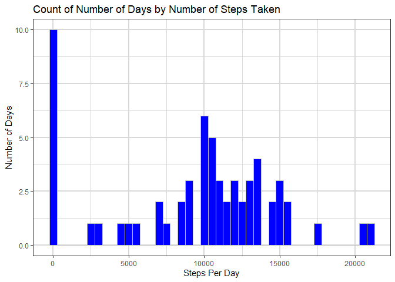
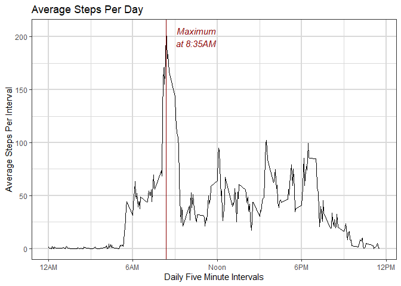
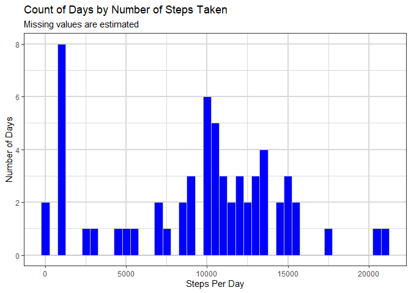
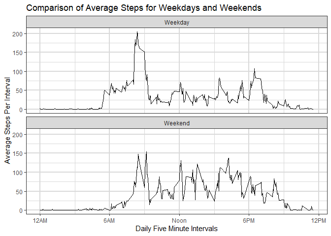

## Loading and preprocessing the data

The activity data set consists of measurements of the number of steps taken
during each five minute interval for each day over a two month period. The data
is in a comma-separated (CSV) file.  For many
of the intervals, the number of steps is not available.  This paper will analyze
the data using two methods, first by omitting the missing data, then by
a simple method of guessing it.

First, we load the data and display the first 10 lines:


``` r
activity <- read.csv("activity.csv")
head(activity)
```

```
##   steps       date interval
## 1    NA 2012-10-01        0
## 2    NA 2012-10-01        5
## 3    NA 2012-10-01       10
## 4    NA 2012-10-01       15
## 5    NA 2012-10-01       20
## 6    NA 2012-10-01       25
```

Since we will be using the dplyr and ggplot libraries, we will load the entire 
"tidyverse", which incorporates them:


``` r
suppressPackageStartupMessages(
library(tidyverse))
```

Now we pre-process the data frame to save duplicate effort.


``` r
processed.activity <- activity |> group_by(date) |> 
  summarise(totsteps = sum(steps, na.rm = TRUE))
```

## What is mean total number of steps taken per day?

In order to plot the total number of steps, we first group the data by day,
then plot a histogram. Note that the histogram does not plot the number of
steps for each day; rather, it plots the number of days for each number
of steps, with 500 step intervals.


``` r
processed.activity |> 
  ggplot(aes(x = totsteps)) +
  geom_histogram(binwidth=500, fill = "blue", col = "gray") +
  labs(x = "Steps Per Day", y = "Number of Days") +
  ggtitle("Count of Number of Days by Number of Steps Taken") +
  theme_bw() + 
  theme(panel.grid = element_line(color = "gray85", linewidth = 1))
```

<!-- -->

We also want to know the mean and the median:


``` r
activity_stats <- processed.activity |> 
       summarize(Mean = mean(totsteps), Median = median(totsteps))
mean <- as.integer(activity_stats[1]$Mean)
median <- as.integer(activity_stats[2]$Median)
print(paste("Daily mean is", mean, "and median is", median))
```

```
## [1] "Daily mean is 9354 and median is 10395"
```

## What is the average daily activity pattern?

We now plot the average number of steps in each 5 minute interval. First,
determine the maximum average and the interval in which it occurs.


``` r
interval.activity <- activity |> 
  group_by(interval) |> 
  summarise(avgsteps = mean(steps, na.rm = TRUE))
maxinterval <- interval.activity |>  
  arrange(avgsteps, interval) |> tail(1)
avg <- as.integer(maxinterval[1, 2])
print(paste("Maximum average was", avg, 
            "and occurred at interval", maxinterval[1, ]$interval))
```

```
## [1] "Maximum average was 206 and occurred at interval 835"
```

The interval "835" is the five minute interval beginning at 8:35 A.M.

The plot can now include a vertical line showing the maximum average number
of steps.


``` r
interval.activity |> 
     ggplot(aes(x = interval, y = avgsteps)) +
     geom_line() +
     labs(x = "Daily Five Minute Intervals", y = "Average Steps Per Interval") +
     ggtitle("Average Steps Per Day") + 
     scale_x_continuous(breaks = c(0, 600, 1200, 1800, 2400),
                        labels = c("12AM", "6AM", "Noon", "6PM", "12PM")) + 
     geom_vline(xintercept = 835, col = "darkred") + 
     annotate("text", x = 1050, y = 200, label ="Maximum\nat 8:35AM", 
              col = "darkred", fontface = "italic") +
     theme_bw() +
     theme(panel.grid = element_line(color = "gray85", linewidth = 1))
```

<!-- -->

## Imputing missing values

Before dealing with the missing values, it's important to know how many there are.


``` r
na_count <- activity |> summarize(na_count = sum(is.na(steps)))
print(paste("There are", na_count$na_count, "missing values"))
```

```
## [1] "There are 2304 missing values"
```
This is 13.1 percent of the total number of values. A simple strategy to 
fill in the missing values is to guess that they are equal to the median
for each interval across the entire two month period.


``` r
activity2 <- activity |> 
  group_by(interval) |> 
  mutate(repvalue = median(steps, na.rm = TRUE)) 

activity2 <- activity2 |> ungroup() 
activity2 <- activity2 |> 
  mutate(steps = ifelse(is.na(steps), repvalue, steps))
```

Once again, calculate the mean and median and plot a histogram of the
total number of steps.


``` r
processed.activity2 <- activity2 |> 
  group_by(date) |> 
  summarise(totsteps = sum(steps)) 
processed.activity2 |> 
   ggplot(aes(x = totsteps)) +
   geom_histogram(binwidth=500, fill = "blue", col = "gray") +
   labs(x = "Steps Per Day", y = "Number of Days", 
        title = "Count of Days by Number of Steps Taken", 
        subtitle = "Missing values are estimated") +
   theme_bw() + 
   theme(panel.grid = element_line(color = "gray85", linewidth = 1))
```

<!-- -->

``` r
activity_stats <- processed.activity2 |> 
       summarize(Mean = mean(totsteps), Median = median(totsteps))
mean <- as.integer(activity_stats[1]$Mean)
median <- as.integer(activity_stats[2]$Median)
print(paste("Daily mean is", mean, "and median is", median))
```

```
## [1] "Daily mean is 9503 and median is 10395"
```

The mean changed from 9354 to 9503, or 149 steps per day. Since the estimated
missing values used the median, the median value did not change.

## Are there differences in activity patterns between weekdays and weekends?

To answer this question, another column is needed to distinguish weekdays (Monday
through Friday) from weekends (Saturday and Sunday). The resulting plot contains
two panels.


``` r
activity2 <- activity2 |> 
  mutate(dayofweek = weekdays(as.Date(date))) |> 
  mutate(weekday = ifelse(dayofweek %in% c("Saturday", "Sunday"), "Weekend", "Weekday"))

activity2 |> 
  summarize(.by = c(weekday, interval), avgsteps = mean(steps)) |> 
  ggplot(aes(x = interval, y = avgsteps)) + 
  geom_line() + 
  labs(x = "Daily Five Minute Intervals", y = "Average Steps Per Interval", 
       title = "Comparison of Average Steps for Weekdays and Weekends") + 
       scale_x_continuous(breaks = c(0, 600, 1200, 1800, 2400),
                          labels = c("12AM", "6AM", "Noon", "6PM", "12PM")) + 
  facet_wrap(~ weekday, nrow = 2) + 
  theme_bw() + 
  theme(panel.grid = element_line(color = "gray85", linewidth = 1))
```

<!-- -->

The maximum number of steps in an interval is about one third higher during weekdays than on weekends.
